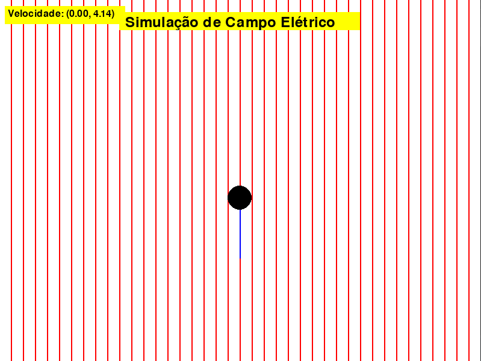

<h1 align="center">Trajetória de uma partícula em um campo elétrico - João 👾</h1>

<h4 align="center"><a href="https://github.com/Jedev1/Trajetoria-de-uma-Particula-em-um-Campo-Eletrico/blob/main/build/exe.win-amd64-3.12/main.exe">Confira o projeto aqui</a></h4>

---

## 💻 Sobre

Projeto feito com o principal de apresentar conceitos físicos.

## 🤯 O jogo é composto por:

- **Home:** Onde o usuário coloca os valores desejados;
- **principal** O jogo ilustrando tudo com base nos valores que o usario colocou na **Home**;

## 🧠 Tecnologias utilizadas:

utilizei as tecnologias:

  

